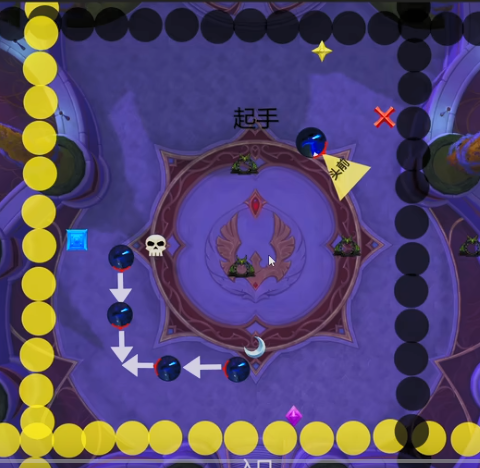

# 12.0 M8 贝洛郎奥之子嗣

## 机制学习

[公会自用M8贝洛朗削弱后流程介绍](https://www.bilibili.com/video/BV1zjd3BiEEM/)



- 染色：你的染色会出现在Debuff中，时刻知道自己是什么颜色。
- 分摊：场地上红叉和星星，根据出球方向决定分摊位置（球先碰到的标在那边分摊，下一次球方向一定是另一种；换句话说，东西夹击的球去东边红叉分摊；南北夹击的球去北边星星分摊）。分摊者站在分摊圈离中场近的位置被击退。
- 挡线：挡线者**站到羽毛（线起始点）的位置**，其他人离开挡线者脚下圈范围，否则秒杀。
- 小怪处理：单点名不用打断（<s=1264696>、<s=1264698>）。**打断同色AOE读条**（<s=1243852>、<s=1243854>）。小怪是鸟时主目标BOSS顺劈小怪，小怪是蛋时**主目标是蛋顺劈BOSS**。
- 球：球碰到墙壁后会随机方向回弹一次，第二次撞墙会消失。所以保证吃掉BOSS身边的球即可。
- 换色：换色时（非第一次染色），有可能延迟换色，所以**如果你的颜色没有变，稍微等一下再吃球**。如果换色时立刻变色可安全处理同色机制。
- 2P1分摊：首次分摊位置选两排球的中点位置（南北夹击的球，分摊去西边蓝方块；东西夹击的球，分摊去南边紫菱）。后续分摊紧贴之前分摊向西南角排开。

## 职业功课

### 平衡德鲁伊（EC）

[参考log](https://www.warcraftlogs.com/reports/GpWZ4H3LVmFbdM7T?fight=18&source=2)

```
CYGAAAAAAAAAAAAAAAAAAAAAAAAAAAAAAAAAAAAAAAWoMLNjxMD8AmFzMzMAzYWGLjFzMjNWmZZmxMzsgBAjttZGMmtBwEAAAgFzMzMD2MmxYAAYmBGA
```

STT时间轴个人方案

```
[方案]
名称=12.0 M8
作者=Paruru

[人员]
玩家=Paruru

{time:00:04,p1} {玩家}{spell:1233272} 起手单月蚀打酱油
{time:00:16,p1} {玩家}{spell:102560} 饰品化身小怪

{time:00:05,p2} {玩家}{spell:102560} P2全爆发
{time:00:25,p2} {玩家}{spell:102560} P2第二个爆发
```

期间艾露恩之怒对齐化身或月蚀。P3留住爆发到P4。

### 平衡德鲁伊（KoTG 2分钟万灵 1分钟树人）

[参考log](https://www.warcraftlogs.com/reports/VMDWfhRaJYz9Fqgw?fight=38&type=summary&source=20)

```
CYGAAAAAAAAAAAAAAAAAAAAAAAAAAAAAAAAAAAAAAAWoMbNMmZgxsYmZmBYYMz2YZGzYjlZWGjZmZBDDwAssN2w0MzyAAAAgNzMzMD2WGGjZAMzAADA
```

STT时间轴个人方案

```
[方案]
名称=12.0 M8
作者=Paruru

[人员]
玩家=Paruru

{time:00:04,p1} {玩家}{spell:194223} 起手饰品超凡万灵（留爆发药）
{time:01:05,p1} {玩家}{spell:205636} 1分钟时树人轨道炮

{time:00:05,p2} {玩家}{spell:194223} P2全爆发
{time:00:20,p2} {玩家}{spell:194223} 爆发结束后立刻第二轮爆发
```

P3树人对齐日蚀，大招留转阶段；一分半后就不要使用树人，留到转阶段对齐爆发。
