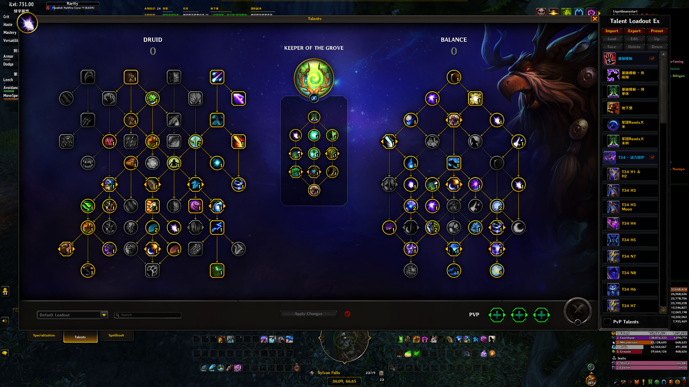

# Remix中的鸟德

## 构筑

### 天赋构筑

```
CYGAkuH5GdQpDrgY32rlVGnyqBAAAAAAAAAAAAAAAAAALUmtmxYmBeAzCLzMzCYGzYmlxsMzMMmlZWGzMzwG2YAGLbzstsNz2sNTzMbzUAAIA2MzYMwmBG
```



### 神器天赋

选择第一行<s=1233577>。

### 属性装备

所有带绿字的部位必须带精通。头、肩和披风部位必须是纯精通属性。

### 首饰装备

佩戴一个给予移动施法技能（<s=1241854>或<s=1258587>）的装备。

剩余部位选择给予<s=1242992>和<s=1241996>的装备。


## 手法

起手：<s=202347>、<s=93402>、<s=1233577>、<s=202770>、<s=205636>、<s=102560>，然后根据情况无限<s=78674>或<s=191034>。

第一波爆发结束后，用<s=1236723>刷新冷却。然后<s=202770>、<s=205636>、<s=102560>，然后根据情况无限<s=78674>或<s=191034>。

关于<s=8921>：<s=205636>的树人会帮你为目标上<s=8921>所以你不需要手动上。有一种情况例外，你决定单体爆发，但是周围有其他怪，此时你无法保证树人会帮你上到正确的目标，此时要在爆发前上一发<s=8921>。

## 视频演示

* [翡翠梦魇](https://www.bilibili.com/video/BV16FsEzaEM5/)
* [暗夜要塞](https://www.bilibili.com/video/BV1Zps7zoET8/)

## 其他构筑

* https://nga.178.com/read.php?tid=45358295&page=1#pid844213202Anchor
* https://nga.178.com/read.php?tid=45358295&page=2#pid844294916Anchor
* https://nga.178.com/read.php?tid=45358295&page=3#pid844708138Anchor
