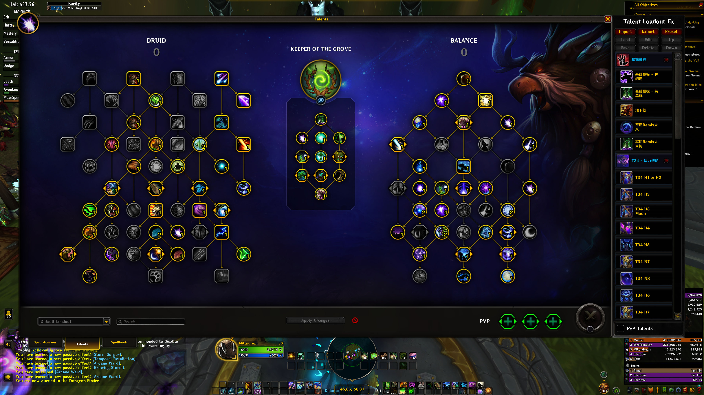

# Remix中的鸟德

## 构筑

```
CYGAkuH5GdQpDrgY32rlVGnyqBAAAAAAAAAAAAAAAAAALUmtmxYmBeAzCLzMzCMGzYmlxsMzMMmtZWGzMzwG2YAGLbzstsNz2sNTzMbzUAAIA2MzYMwmBG
```



## 手法

起手：<s=202347>、<s=93402>、<s=1233577>、<s=202770>、<s=205636>、<s=102560>，然后根据情况无限<s=78674>或<s=191034>。

第一波爆发结束后，用<s=1236723>刷新冷却。然后<s=202770>、<s=205636>、<s=102560>，然后根据情况无限<s=78674>或<s=191034>。
