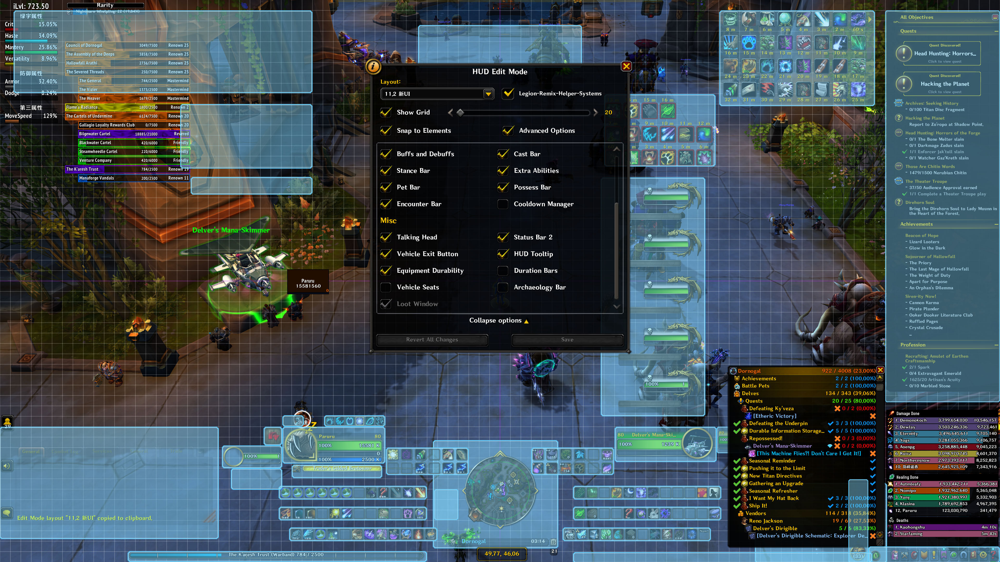

# 游戏自带配置

## UI缩放

首先调整UI缩放，在图形设置中勾选“Use UI Scale”，然后根据分辨率设置。不合适的UI缩放会导致诸如WA的边框像素不一致的问题（[为什么？](https://bbs.nga.cn/read.php?tid=44771356)）。

- 1920x1080和3840x2160使用71%。 `/run SetCVar("UIScale", 0.7111111111)`

## 编辑模式

打开编辑模式，导入如下配置：

```
1 43 0 0 0 7 7 UIParent -282.5 122.0 -1 ##$$%/&#'%)$+$,$ 0 1 0 7 7 UIParent 282.5 122.0 -1 ##$$%/&#'%(#,$ 0 2 0 7 7 UIParent -282.5 82.0 -1 ##$$%/&#'%(#,$ 0 3 0 7 7 UIParent 282.5 82.0 -1 ##$$%/&#'%(#,$ 0 4 0 7 7 UIParent -262.5 42.0 -1 ##$$%/&#'%(#,$ 0 5 0 7 7 UIParent 262.5 42.0 -1 ##$$%/&#'%(#,$ 0 6 0 1 1 UIParent -139.5 -862.0 -1 ##$%%/&#'+(#,$ 0 7 0 1 1 UIParent 139.5 -862.0 -1 ##$%%/&#'+(#,$ 0 10 0 8 2 PlayerFrame -18.0 -12.0 -1 ##$$&$'% 0 11 0 2 8 PetFrame -4.0 2.0 -1 ##$%&$'%,# 0 12 0 6 0 PlayerFrame 20.0 -12.0 -1 ##$$&$'% 1 -1 0 2 8 PlayerFrame -24.0 -0.0 -1 ##$$%# 2 -1 0 7 7 UIParent -8.5 28.0 -1 #$$#%% 3 0 0 1 1 UIParent -320.0 -806.0 -1 $$3# 3 1 0 1 1 UIParent 318.0 -804.0 -1 %$3# 3 2 0 0 2 TargetFrame -31.5 -4.0 -1 %#&#3# 3 3 0 0 0 UIParent 588.7 -582.0 -1 '$(#)#-#.#/#1$3# 3 4 0 0 0 UIParent 8.7 -304.0 -1 ,#-#.#/#0#1#2( 3 5 0 2 2 UIParent -567.7 -343.0 -1 &$*#3# 3 6 0 2 2 UIParent -573.3 -826.8 -1 -#.#/#4& 3 7 0 2 8 MainMenuBarVehicleLeaveButton 4.0 -1.0 -1 3# 4 -1 0 1 1 UIParent -477.0 -342.0 -1 # 5 -1 0 1 1 UIParent -487.0 -202.0 -1 # 6 0 0 1 1 UIParent 570.5 -22.0 -1 ##$#%#&+(()( 6 1 0 7 7 UIParent 307.0 762.0 -1 ##$$%$')(()( 7 -1 0 1 1 UIParent -647.0 -22.0 -1 # 8 -1 0 1 1 UIParent -747.0 -882.0 -1 #&$_%$&7 9 -1 0 2 0 PlayerFrame 16.0 -16.0 -1 # 10 -1 0 1 1 UIParent -408.0 -22.0 -1 # 11 -1 0 5 5 UIParent -218.7 -469.7 -1 # 12 -1 0 1 1 UIParent 861.0 -21.5 -1 #_$-$$%# 13 -1 0 5 5 UIParent -2.0 -586.0 -1 ##$#%#&# 14 -1 0 8 6 MicroMenuContainer -3.5 -0.5 -1 #$$#%# 15 0 0 7 7 UIParent -347.5 2.0 -1 # 15 1 0 7 7 UIParent 347.5 2.0 -1 # 16 -1 0 1 1 UIParent -103.3 -941.5 -1 ## 17 -1 1 1 1 UIParent 0.0 -100.0 -1 ## 18 -1 0 2 0 PlayerFrame 16.0 -16.0 -1 #- 19 -1 0 1 1 UIParent 0.0 -112.8 -1 ## 20 0 1 7 7 UIParent 0.0 310.0 -1 ##$/%$&('%(-($)#+$,$-$ 20 1 1 7 7 UIParent 0.0 240.0 -1 ##$*%$&('%(-($)#+$,$-$ 20 2 1 7 7 UIParent 0.0 370.0 -1 ##$$%$&('((-($)#+$,$-$ 20 3 1 7 7 UIParent 420.0 430.0 -1 #$$$%#&('((-($)#*#+$,$-$
```

该配置的样式如下：




